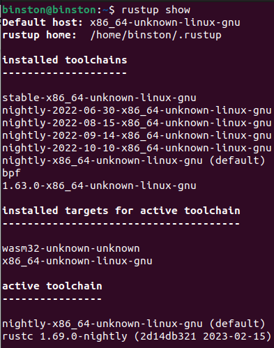
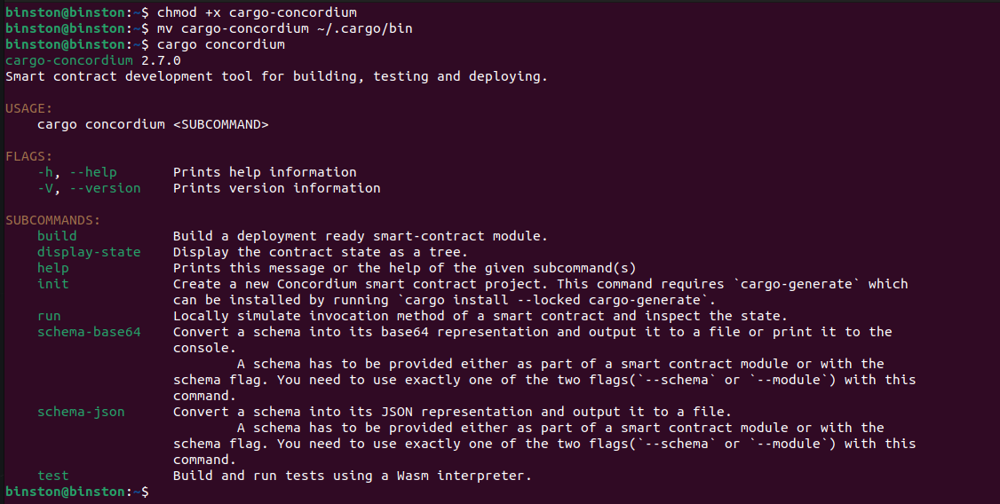
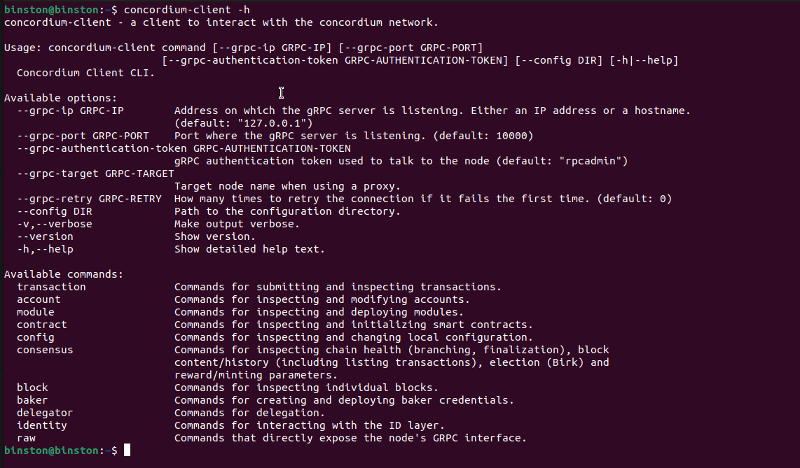
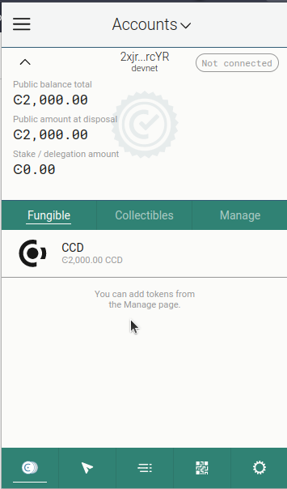
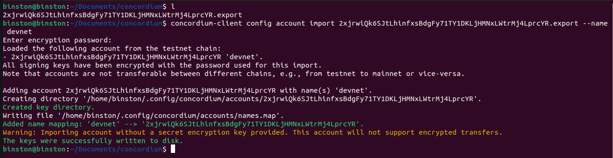

# c.h-task-1

## Step 1: Install Rust

Installed Rust and wasm toolchain

```lang=bash
rustup show
```



## Install cargo-concordium

Install cargo-concordium



## Install concordium-client

Install Concordium-client



## Create a Testnet account and Acquiring testnet CCD via the CCD faucet

Create testnet account and recieved ccd from CCD faucet



## Export the account from web wallet and import it into concordium client



CCD Mainnet Address:  
```
3tcvR9Mq1Hr95qXYby8CPm5nhNkXk5eKxANJp4m5mUqYbA4kCR 
```
